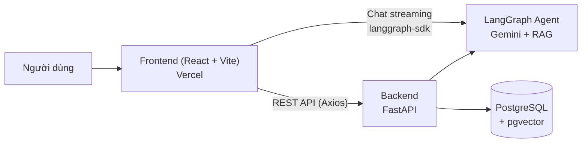

# AI-Chatbot Digital Banking — Web (Frontend)

Ứng dụng web **ngân hàng số tích hợp trợ lý AI**, xây bằng **React 19 + Vite**. Gồm hai khu vực tách biệt trong cùng một SPA:

- **Client** (`/customer`) — cổng khách hàng: tài khoản, tiết kiệm, chuyển tiền, thống kê và **chatbot AI** tư vấn theo thời gian thực.
- **Admin** (`/admin`) — trang quản trị: quản lý khách hàng và **Knowledge Base** cung cấp tri thức cho chatbot (RAG).

Giao diện lấy cảm hứng từ ngân hàng số hiện đại (Techcombank-style).

> 🔗 **Backend:** [`ai-chatbot-digital-banking-web-backend`](https://github.com/NguyenQuyenHacker/ai-chatbot-digital-banking-web-backend) — FastAPI + LangGraph agent.

---

## Table of Contents

- [Features](#features)
- [Architecture](#architecture)
- [Tech Stack](#tech-stack)
- [Project Structure](#project-structure)
- [Routes](#routes)
- [Getting Started](#getting-started)
- [Scripts](#scripts)
- [Deployment](#deployment)

## Features

**Khách hàng**
- Đăng ký / đăng nhập, phiên đăng nhập bảo vệ bằng route guard riêng.
- Trang chủ tổng quan, hồ sơ cá nhân, cài đặt (profile / bảo mật / hiển thị).
- Quản lý tài khoản, **chuyển tiền**, **tài khoản tiết kiệm**.
- **Thống kê** trực quan bằng biểu đồ (Recharts).
- **Trợ lý AI**: chat streaming, render Markdown, kết nối trực tiếp LangGraph agent.
- Đa ngôn ngữ (i18n) qua `LanguageProvider`.

**Admin**
- Đăng nhập admin với luồng xác thực & route guard tách biệt khỏi client.
- Tổng quan hệ thống, quản lý khách hàng.
- **Knowledge Base**: tạo/cấu hình nguồn tri thức, quản lý documents cho pipeline RAG.

## Architecture



Frontend giao tiếp với backend qua Axios (`VITE_API_URL`). Riêng luồng chat kết nối tới LangGraph agent qua `@langchain/langgraph-sdk` để nhận token streaming.

## Tech Stack

| Nhóm | Công nghệ |
|---|---|
| Core | React 19, Vite 7, JavaScript (JSX) |
| Routing | React Router 7 (protected/public routes) |
| Data fetching | TanStack Query, Axios |
| AI / Chat | `@langchain/langgraph-sdk`, `langchain`, `react-markdown` + `remark-gfm` |
| Biểu đồ | Recharts |
| Styling | CSS Modules |
| Icons | lucide-react |
| Lint | ESLint 9 |
| Deploy | Vercel |

## Project Structure

```
src/
├── client/                     # Ứng dụng phía khách hàng
│   ├── api/                    # Axios instance + API modules
│   ├── components/             # Header, Sidebar, Footer, ChatbotBar...
│   ├── pages/                  # Login, Signup, CustomerLayout + screens
│   ├── router/                 # ClientProtectedRoute / ClientPublicRoute
│   ├── context/                # State dùng chung phía client
│   └── i18n/                   # LanguageProvider, bản dịch
├── admin/                      # Trang quản trị
│   ├── api/                    # Axios instance cho admin
│   ├── pages/                  # Overview, Users, KnowledgeBase...
│   ├── router/                 # AdminProtectedRoute / AdminPublicRoute
│   └── context/                # AdminContext (auth admin)
├── styles/                     # Theme / CSS toàn cục
├── utils/                      # Helper dùng chung
├── App.jsx                     # Định nghĩa toàn bộ route
└── main.jsx                    # Entry point
```

## Routes

| Route | Khu vực | Mô tả |
|---|---|---|
| `/login`, `/signup` | Client (public) | Đăng nhập / đăng ký khách hàng |
| `/customer/home-page` | Client (protected) | Trang chủ khách hàng |
| `/customer/accounts` | Client | Danh sách tài khoản |
| `/customer/transfer` | Client | Chuyển tiền |
| `/customer/savings` | Client | Tài khoản tiết kiệm |
| `/customer/statistics` | Client | Thống kê (biểu đồ) |
| `/customer/settings/*` | Client | Hồ sơ / bảo mật / hiển thị |
| `/admin/login` | Admin (public) | Đăng nhập admin |
| `/admin/overviews` | Admin (protected) | Tổng quan hệ thống |
| `/admin/customers` | Admin | Quản lý khách hàng |
| `/admin/knowledge-bases/*` | Admin | Quản lý Knowledge Base cho RAG |

## Getting Started

### Prerequisites
- **Node.js ≥ 18** (khuyến nghị bản LTS)
- Backend đang chạy (xem repo [`ai-chatbot-digital-banking-web-backend`](https://github.com/NguyenQuyenHacker/ai-chatbot-digital-banking-web-backend))

### Installation & Run

```bash
# 1. Clone repo về máy
git clone https://github.com/NguyenQuyenHacker/ai-chatbot-digital-banking-web-frontend.git
cd ai-chatbot-digital-banking-web-frontend

# 2. Cài dependencies
npm install

# 3. Cấu hình biến môi trường
#    Tạo file .env ở thư mục gốc, trỏ tới backend
echo "VITE_API_URL=http://localhost:8000" > .env

# 4. Chạy dev server (hot reload)
npm run dev
```

Ứng dụng chạy tại **http://localhost:5173**

### Environment Variables

| Biến | Bắt buộc | Mô tả |
|---|:---:|---|
| `VITE_API_URL` | ✅ | URL gốc của backend API (fallback `http://127.0.0.1:8000`) |

> Vite chỉ expose biến có tiền tố `VITE_` ra client — không đặt secret nhạy cảm ở đây.

## Scripts

| Lệnh | Tác dụng |
|---|---|
| `npm run dev` | Chạy dev server (Vite, HMR) |
| `npm run build` | Build production ra `dist/` |
| `npm run preview` | Xem thử bản build |
| `npm run lint` | Kiểm tra ESLint |

## Deployment

Triển khai trên **Vercel**:

1. Import repo → Vercel tự nhận framework **Vite**.
2. Thêm biến môi trường `VITE_API_URL` = URL backend đã deploy.
3. Deploy. File [`vercel.json`](./vercel.json) đã cấu hình rewrite mọi path về `index.html` để SPA routing hoạt động.

---

<sub>Đồ án học tập — mô phỏng nghiệp vụ ngân hàng số kết hợp trợ lý AI (RAG).</sub>
